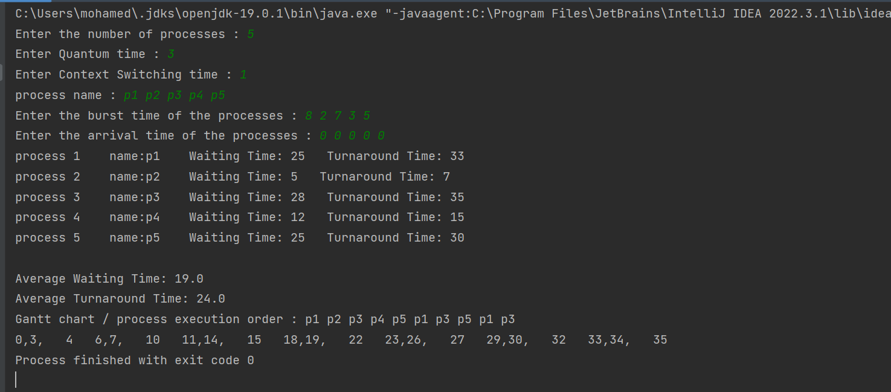

# RoundRobin-Scheduler 

# Overview:
RoundRobin-Scheduler is an alogrithm in OS that schedules the running processes in CPU according to its priority  

# Requirements:
1. output a table displaying each process with its arrival time and turnaround time
2. output the avg time , avg turnaround time
3. output the process excution order

# Test Case example : 

